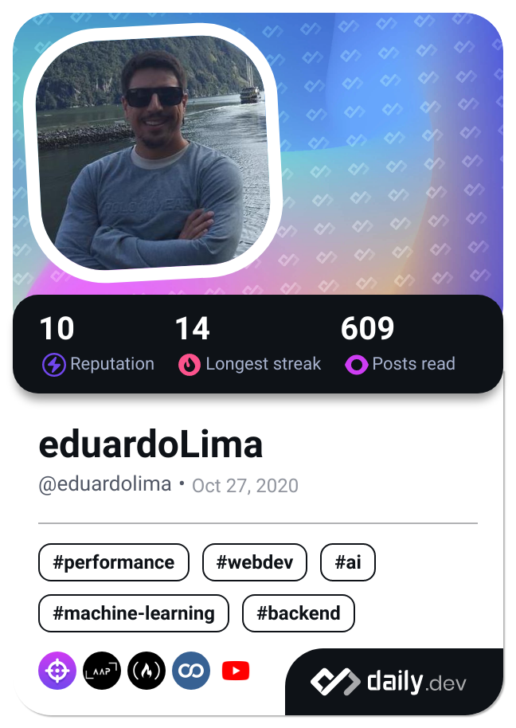

<!--horizontal divider(gradiant)-->

# <b>Hi</b> , I'm [Carlos Eduardo!](https://github.com/Eduardolimacesl/)

<b></b>

## <picture></picture> **About me**

- Civil Engineer
- A passionate Self-taught web developer
- BIM manager
- BIM software developer

 

## <picture></picture> **Tech Stack**

## <b> GitHub Analytics</b>

|  |  |
| :----------------------------------------------------------------------------------------------------------: | :-------------------------------------------------------------------------------------------------------------------------: |

|  |
| :--------------------------------------------------------------------------------------------------------------------: |

---
